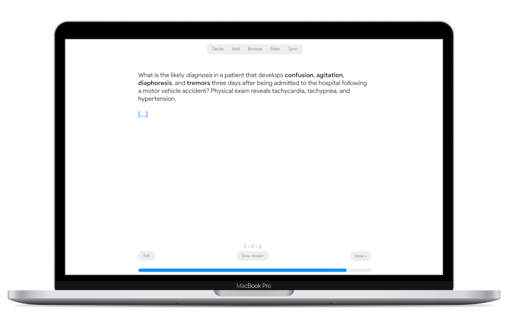

# Redesign
A new look for [Anki](https://apps.ankiweb.net/).

   
 

 

### How to contribute

(coming soon)

 

### License

*Copyright © 2020 [Developer Nick](https://twitter.com/nickdvlpr)*

This program is distributed in the hope that it will be useful, but WITHOUT ANY WARRANTY.

 

### Credits

Special thanks to the author of [Night Mode](https://ankiweb.net/shared/info/1496166067) and to those who supported its development on Patreon and elsewhere, especially [Basiskarten Jura](https://www.basiskarten.de/).

Redesign is released under the GNU AGPLv3 license, extended by a number of additional terms. For more information please see the [LICENSE](https://github.com/nickdvlpr/Redesign/blob/master/LICENSE) file that accompanied this program.
